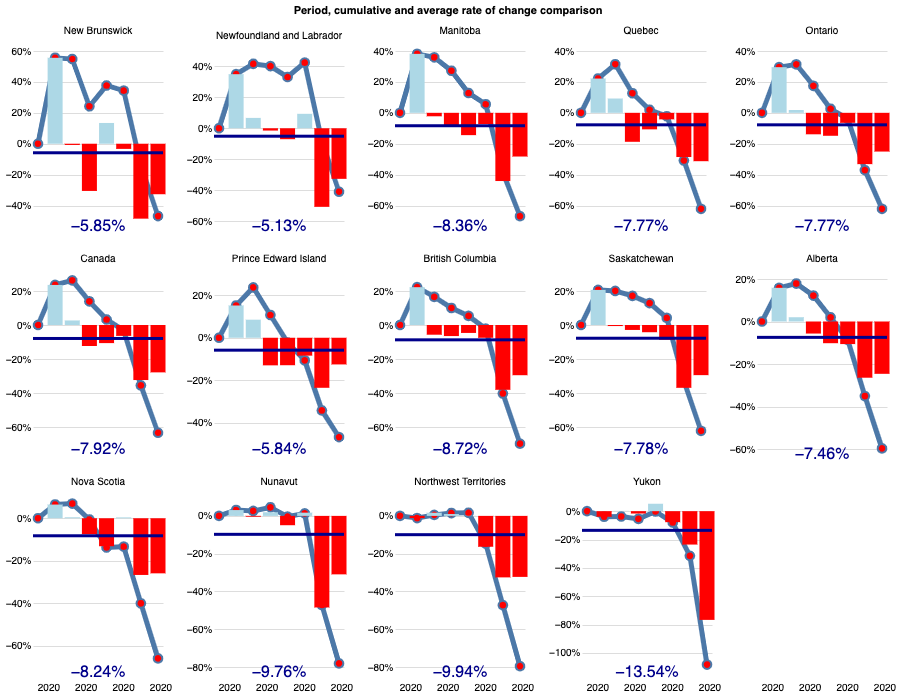
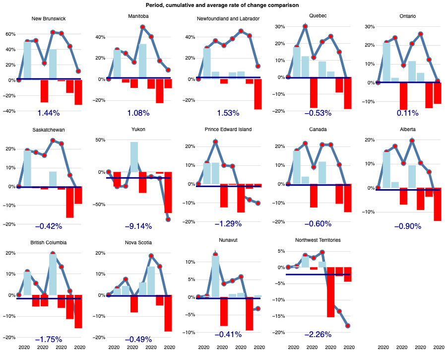
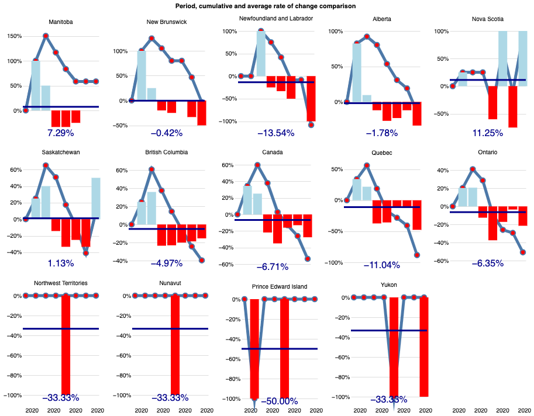

# % of Supported Businesses Exploration

## Exploring the  ‘Accommodation and food services’ and ‘Arts, entertainment and recreation’ industries

The economic restrictions and social distancing measures during the COVID-19 pandemic have caused major disruptions to Canadian businesses. The travel- and tourism-related industries, such as transportation, restaurants, accommodation, and arts and entertainment, are the hardest hit by the COVID-19 pandemic [1].

Since the first four-week period (March 15, 2020), CEWS was effective in targeting the hardest hit industries. Figure 1 shows the proportion of business supported by the total number of businesses by North American Industry Classification System (NAICS) two-digit industry sector [2].

The ‘Accommodation and food services’ industry sector was the most supported, with roughly 4 out 10 businesses receiving support from the CEWS. Following was the ‘Arts, entertainment and recreation’ industry sector supporting approximately 35 per cent of businesses.

The ‘Accommodation and food services’ industry sector proportion of business supported by the CEWS peaked in summer reaching a ratio of 45 per cent business supported in the fifth four-week claim period (July 05,2020).  Figure 2 shows the evolution of the number of business supported in the accommodation and food services industry sector in the first eight four-week CEWS claim periods.

The CEWS support provided to the ‘Arts, entertainment and recreation’ industry sector peaked in the third four-week period (May 10, 2020) reaching a proportion of approximately 38 per cent businesses supported. Figure 3 shows the evolution of the number of business supported in the arts, entertainment, and recreation industry sector in the first eight four-week CEWS period.

At the beginning of the CEWS program (March 15, 2020), in the accommodation and food services industry sector, the most supported province was British Columbia (45 per cent), followed by Alberta (45 per cent). At a country and province/territory level, figure 4 shows the proportion of business supported by the total number of businesses in the accommodation and food services industry sector.

When breaking down the accommodation and food services industry to subsectors (NAICS three-digit level), the proportion of supported businesses is roughly the same for the ‘Accommodation services’ and the ‘Food services and drinking places’ industry subsectors (39 and 41 per cent respectively). At this level of breakdown, British Columbia and Alberta had the most business supported by CEWS.

At a country and province/territory level, figure 5 shows the proportion of business supported by the total number of businesses in the food services and drinking places industry subsector. Figure 6 shows the same information for the accommodation services industry subsector. 

At the beginning of the CEWS program (March 15, 2020), approximately 1 out of 2 businesses in the accommodation services industry subsector in Alberta received support from the CEWS program. This figure expanded to 53 per cent on the third four-week period of the program (May 10, 2020). Figure 7 shows the evolution of the number of business supported in the accommodation services industry subsector in Alberta in the first eight four-week CEWS period.

Looking at the evolutuion of the other variables in Alberta in the accomodation services industry subsector **(pending to explore and analyze)**.

**Pending ‘Arts, entertainment and recreation’ industry analysis**

## Exploring the  ‘Transporation and warehousing’ industry

Comparing the evolution of the different interest variables across provinces and territories **(pending to analyze)**

[1] https://www150.statcan.gc.ca/n1/pub/11-626-x/11-626-x2020017-eng.htm 

[2] https://www150.statcan.gc.ca/t1/tbl1/en/cv.action?pid=3310030401 
