# Week 2 Example Report

Please note that all of these visualizations are very rough right now and the aesthetics would be revised and improved for any graphs included in a final product. This is meant just as a guide to the ideas we have been pursuing, and is primarily meant as a guide to which trains of thought you would like us to dig into more, and which should be left on the cutting room floor. 

## Part 1: Overall Trends

While this section is not necessarily interesting to StatCan, we will need to include it in our report for the University in order to give context to the more specific findings below.

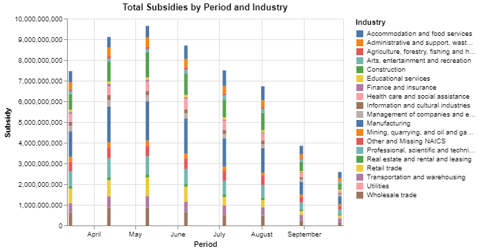

All of the information from the first graph is included in the second, but there are too many industries for the second to be particularly legible. This graph could potentially be replaced with a facetted set of pie charts which shows proportions in each time period.

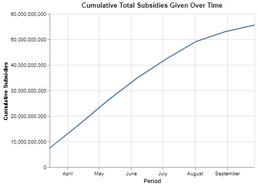

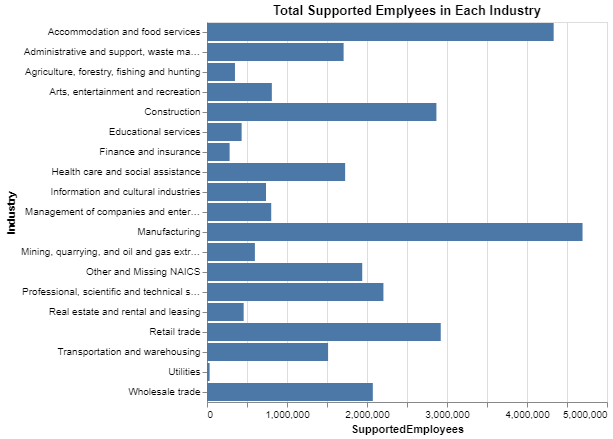

Using "supported employees" and aggregating over time is a little disingenuous since many employees will be counted multiple times (we aren't measuring unique employees). As such, this point will either need to be made very clear, or supported employees will not be used when aggregating over time. 

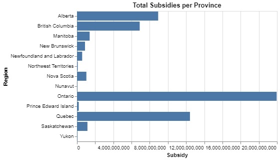

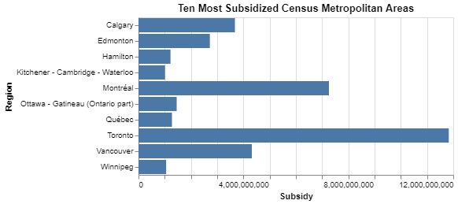

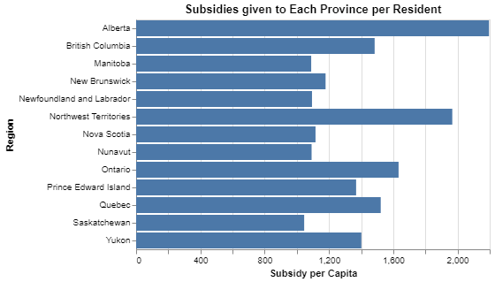

I know you didn't like the "per capita" terminology, but I'm not entirely sure what to use instead.

## Part 2: Proportion of Businesses Receiving Subsidies

The next graph needs to be improved with a better color scheme. The one below it is probably too busy to ever be useful.

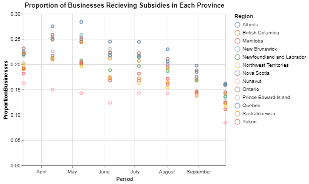

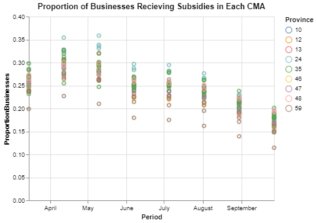

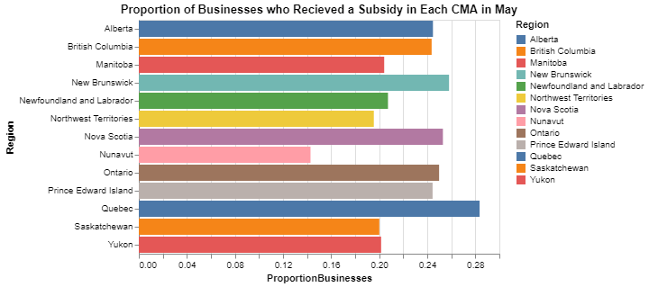

The above graph is meant to say "Province", not "CMA". The below graph is also in the May period, and would need a mapping for the legend to Province names.

Note the color schemes don't align here, and work needs to be done to ensure the colors are consistent.

The take away here is that a lot of Quebec businesses received subsidies, but on average those subsidies are smaller than some other provinces (especially Alberta).

We also have data on business counts by Census subdivision, but due to all the suppressed data I don't think we would get anything useful out of it.

## Part 3: Exploring the Most Subsidized Census Agglomerations (Per Resident)

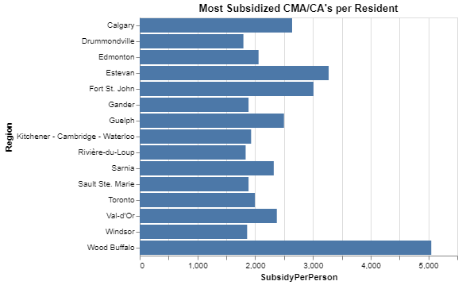

By far the agglomeration receiving the most subsidy money per- resident is Wood Buffalo (the area containing Fort McMurray and the Athabasca oil sands). Next are Estevan, SK, and Fort St. John, BC. 

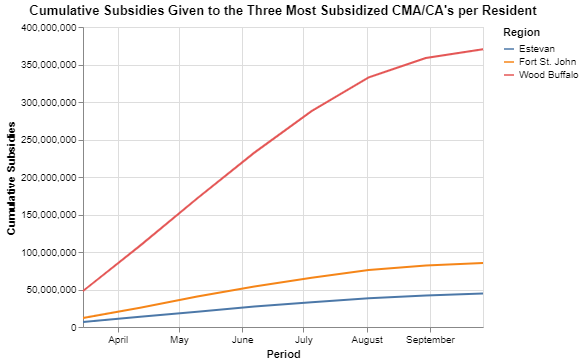

The rate at which given subsidies increased over time was far greater for Wood Buffalo than for the others.

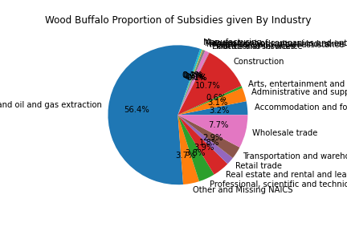

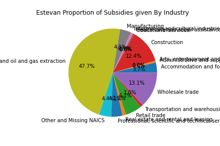

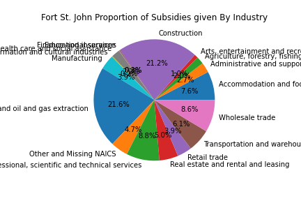

These pie charts are messy as HECK with all the labels. I would probably keep the top 2 or 3 industries for each, and compile the rest into one slice of "other industries". The main takeaway from this is that the most subsidized industry in all three agglomerations is "mining, quarrying, and oil and gas extraction", which seems to imply that even in smaller towns and more "rural" areas, a lot of the subsidy money is still going to the large oil companies. 

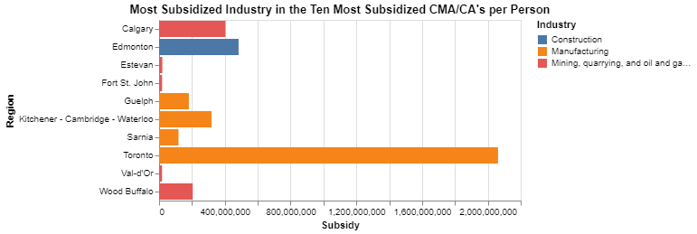

(These graphs will ideally be a choropleth map once I figure that out). In each of the ten most subsidized CMA/CA's (per population unit), the top subsidized industry is either construction, oil and gas, or manufacturing. 

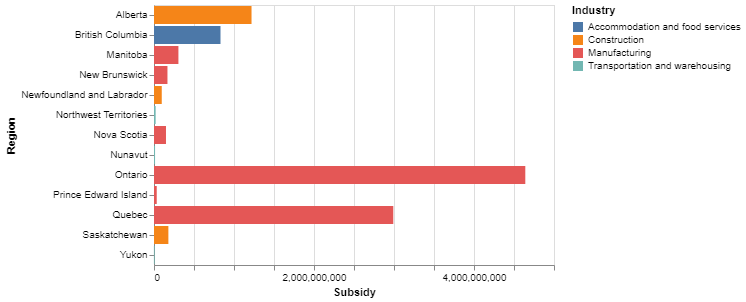

By province, the most subsidized industries are either transportation and warehousing (Territories), manufacturing, construction, or Accommodation and Food Service. Accommodation and food service is only the most subsidized in BC, which could be due the the heavy reliance of the province on tourism.

## Part 4: BC's Most Subsidized Industry

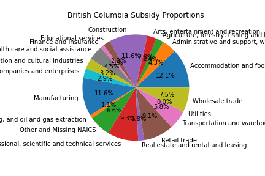

Like the other pie charts, this would be cleaned up by compiling the small slices into "other industries"

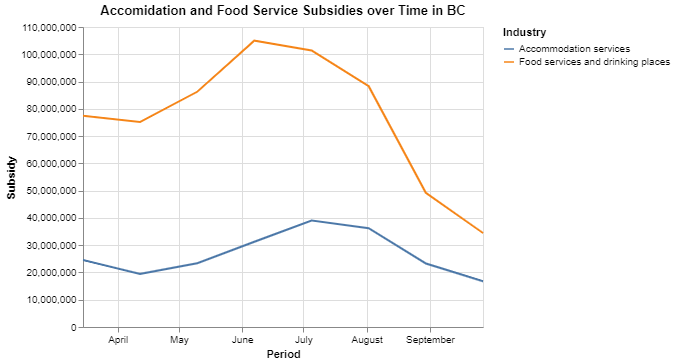

We see the subsidies in this industry peaked in June and July. Overall, subsidies given were highest in April and May, so this furthers the narrative that many of these subsidies are necessary due to the loss of tourism money in the summer. 

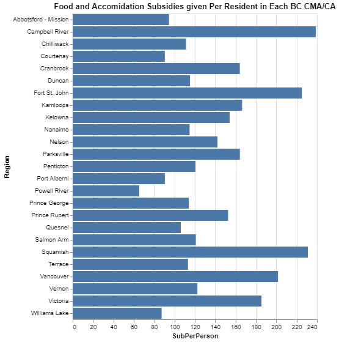

## Part 5: Proportion of Businesses Supported in Each Sector

The economic restrictions and social distancing measures during the COVID-19 pandemic have caused major disruptions to Canadian businesses. The travel- and tourism-related industries, such as transportation, restaurants, accommodation, and arts and entertainment, are the hardest hit by the COVID-19 pandemic [1].

Since the first four-week period (March 15, 2020), CEWS was effective in targeting the hardest hit industries. Figure 1 shows the proportion of business supported by the total number of businesses by North American Industry Classification System (NAICS) two-digit industry sector [2].

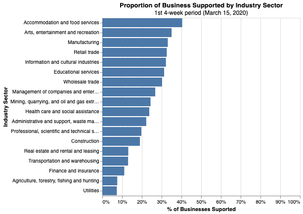

The ‘Accommodation and food services’ industry sector was the most supported, with roughly 4 out 10 businesses receiving support from the CEWS. Following was the ‘Arts, entertainment and recreation’ industry sector supporting approximately 35 per cent of businesses.

### Exploring the  ‘Accommodation and food services’ and ‘Arts, entertainment and recreation’ industries

The ‘Accommodation and food services’ industry sector proportion of business supported by the CEWS peaked in summer reaching a ratio of 45 per cent business supported in the fifth four-week claim period (July 05,2020).  Figure 2 shows the evolution of the number of business supported in the accommodation and food services industry sector in the first eight four-week CEWS claim periods.

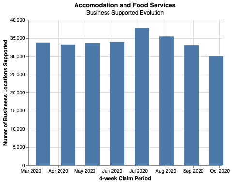

The CEWS support provided to the ‘Arts, entertainment and recreation’ industry sector peaked in the third four-week period (May 10, 2020) reaching a proportion of approximately 38 per cent businesses supported. Figure 3 shows the evolution of the number of business supported in the arts, entertainment, and recreation industry sector in the first eight four-week CEWS period.

At the beginning of the CEWS program (March 15, 2020), in the accommodation and food services industry sector, the most supported province was British Columbia (45 per cent), followed by Alberta (45 per cent). At a country and province/territory level, figure 4 shows the proportion of business supported by the total number of businesses in the accommodation and food services industry sector.

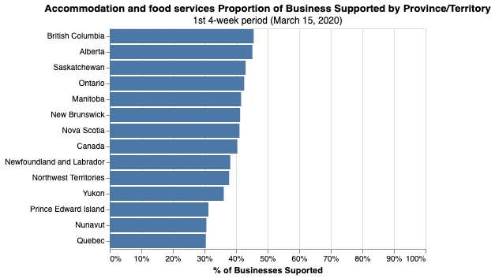

When breaking down the accommodation and food services industry to subsectors (NAICS three-digit level), the proportion of supported businesses is roughly the same for the ‘Accommodation services’ and the ‘Food services and drinking places’ industry subsectors (39 and 41 per cent respectively). At this level of breakdown, British Columbia and Alberta had the most business supported by CEWS.

At a country and province/territory level, figure 5 shows the proportion of business supported by the total number of businesses in the food services and drinking places industry subsector. Figure 6 shows the same information for the accommodation services industry subsector. 

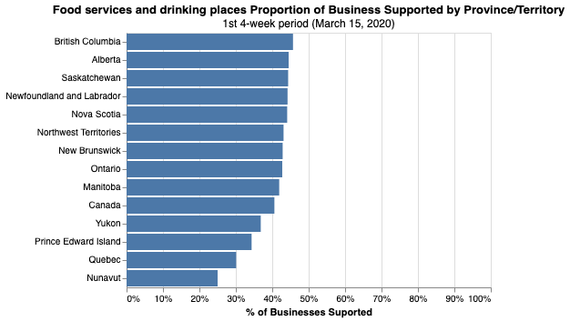

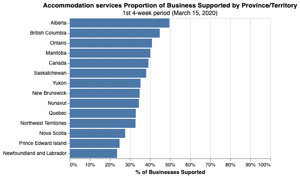

At the beginning of the CEWS program (March 15, 2020), approximately 1 out of 2 businesses in the accommodation services industry subsector in Alberta received support from the CEWS program. This figure expanded to 53 per cent on the third four-week period of the program (May 10, 2020). Figure 7 shows the evolution of the number of business supported in the accommodation services industry subsector in Alberta in the first eight four-week CEWS period.

Looking at the evolution of the other variables in Alberta in the accommodation services industry subsector **(pending to explore and analyze)**.

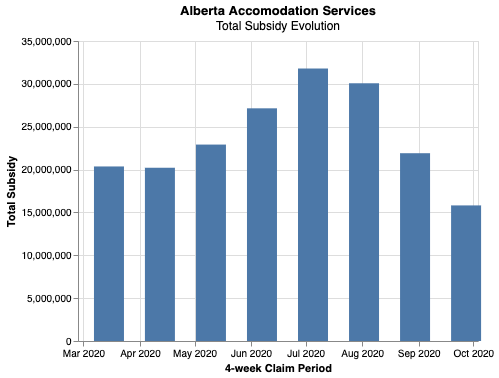

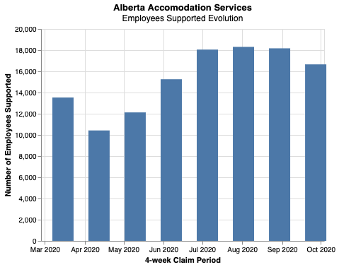

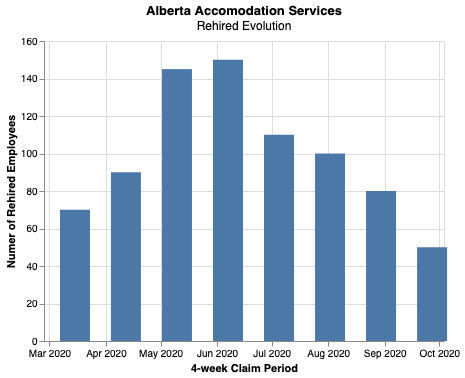

## Part 5: Urban vs. Rural

I'm not sure how far it's worth pursuing this topic, since you guys already wrote an entire paper on it.

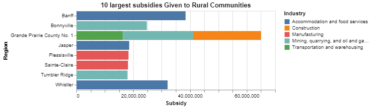

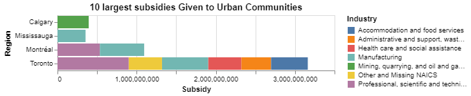

## Part 6: "Transportation and Warehousing"

As this is the only industry that does not have suppressed data at the Provincial level in any Province (due to the Territories). Comparing the evolution of the different interest variables across provinces and territories **(pending to analyze)**

Change in the amount of monthly subsidy given to each Province over time. The line represents total subsidy, and the bars represent percent change. The blue number represents the average monthly change in subsidy given.

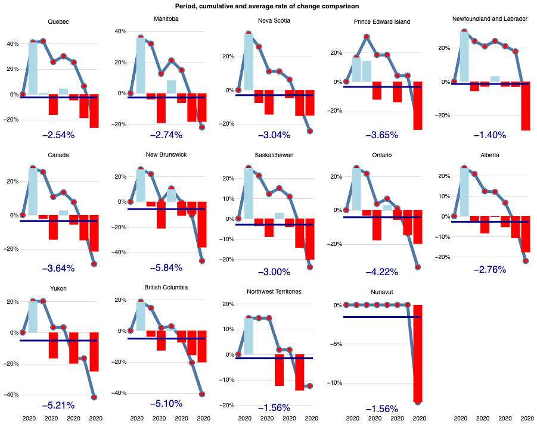