# Week 3 Report

Authors note: for now we leave out specific numbers, as they are sure to change with the addition of the second half of the data. Hopefully general trends will not change too much, so we report on those. Also, we still need to decide on a consistent color scheme for the different categorical divisions.

## Part 1: The most heavily subsidized provinces and agglomerations are dependent on mining, oil, and gas

On a provincial level, Alberta received the most subsidy money per resident, followed by Northwest Territories. The economy of both these regions is very dependent on mining. oil and gas.

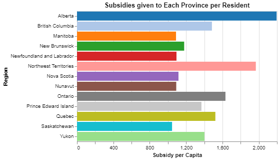

When we investigate at the CMA/CA level, the three regions which received the most subsidy money per resident have mining, oil and gas as their most subsidized industry.  The pie charts below show the three most subsidized industries, with all others included in "other".

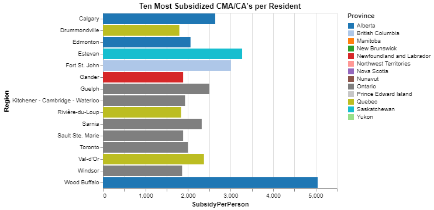

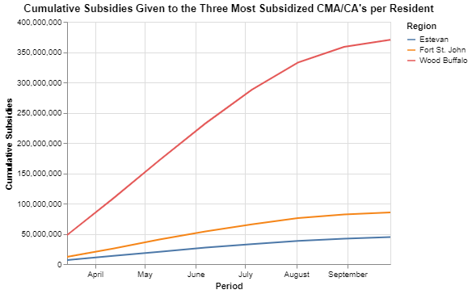

Authors note: I'm not sure why the text gets cut off on these when I save as png images, but I will try to figure out how to fix this. 

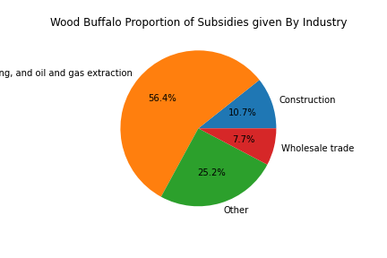

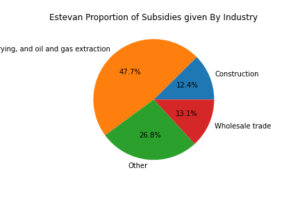

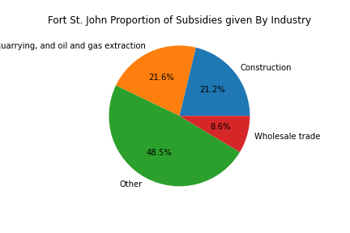

Looking at the most subsidized industry in each of the ten most subsidized CA/CMA's, we see that the majority are either mining, oil and gas or manufacturing. There is also a pretty clear geographic divide, with subsidies in Ontario and Quebec agglomerations favoring manufacturing (aside from Val-d'Or, the "valley of gold" is obviously a mining area), and mining, oil and gas in the prairies (aside from Edmonton). Gander is a town in Newfoundland which acts as a refueling stop for transatlantic flights.

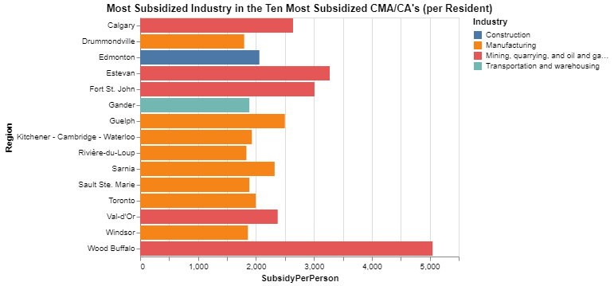

While the most subsidized regions are dependent on mining, oil and gas, it is not the most subsidized industry in any province (even Alberta). Construction and manufacturing take the lead in most provinces, with accommodation and food service the most subsidized in BC, and transportation and warehousing top in the territories.

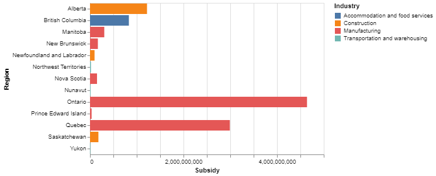

## Part 2: Rural areas in Alberta and urban areas in Quebec received the most subsidies.

First, we see that the vast majority of subsidy money was given to companies in urban areas. 

Here we see the ten largest industry subsidies given to urban and rural CSD's. There is a clear difference in the industries that tend to be supported in each, with "manufacturing " being the one industry that is heavily subsidized in both. 

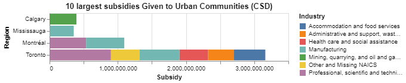

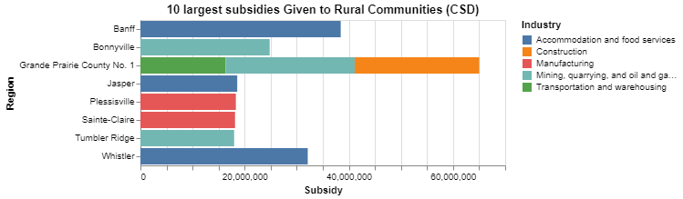

There is an obvious geographic difference in the location of heavily subsidized urban vs. rural CSD's. The majority of the most subsidized rural regions are located in Alberta, while the majority of the most subsidized Urban areas are in Ontario. Grande Prairie, Alberta is the most subsidized rural CSD in Canada, and Toronto is the most subsidized urban CSD. 

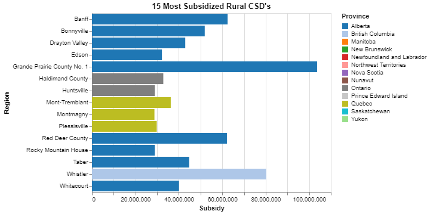

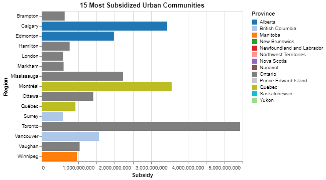

When we control for population, the story changes a bit. We look only at areas with permanent populations greater than 1000 in order to control for the noise of small denominators. Rural regions in Alberta are still disproportionately represented, but in urban areas Quebec seems to receive the most subsidies per resident. Per resident, Banff is the most subsidized rural CSD, and Montreal-Est is the most subsidized urban CSD. 

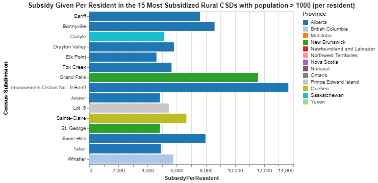

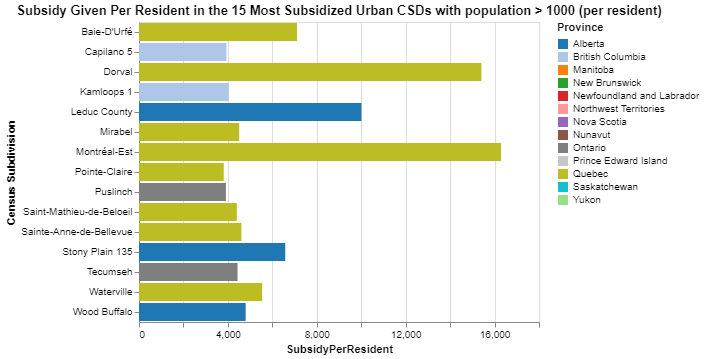

## Part 3: Three industries are heavily subsidized in rural areas

Authors Note: We could do a similar analysis for urban areas as well without much extra work. It depends on if the focus of the paper should be on rural Canada, or differences between urban and rural.

Here we see that within rural areas of Canada, the most subsidized industries are manufacturing, construction, and accommodation and food services.

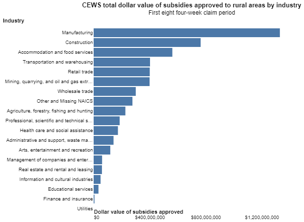

The story is a bit different when we look at the average number of rehired employees and supported businesses in each claim period. Manufacturing received the most money by a wide margin, but was sixth in rehired employees and 5th in supported businesses.  Retail received the 5th most money, but supported the most employees and second most businesses. 

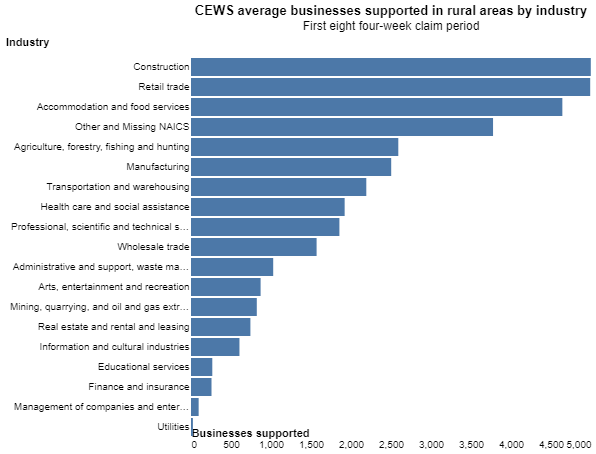

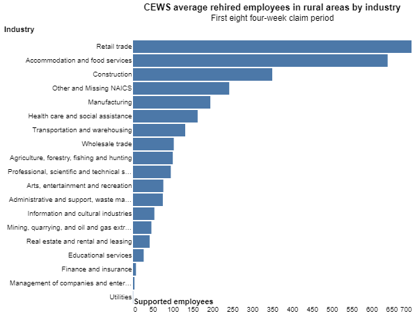

We examine the three industries which received the mist subsidy money in rural areas. We notice that the accommodation and food services industry does not follow the same distribution over time as the CEWS program as a whole. In general, the most money was given out in the April and May periods, but rural accommodation and food service businesses received the most subsidies in the July and August periods. This is likely due to the reliance on many rural restaurants and hotels on summer tourism, while manufacturing is rarely seasonal, and varieties of construction occur year round. 

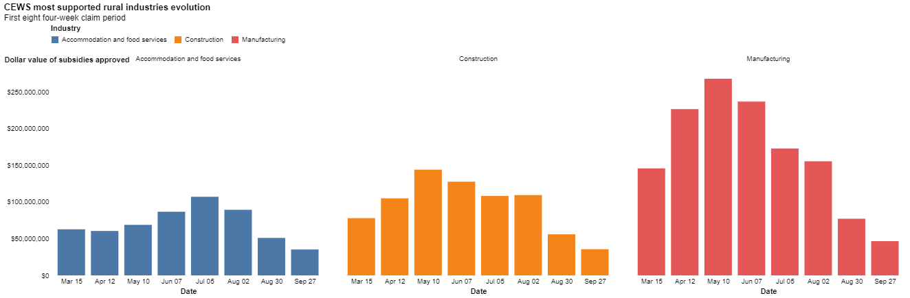

Here we see that over half of workers in accommodation and food service in rural areas were supported by CEWS. While manufacturing and construction received more money, they supported less workers. 

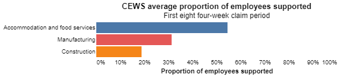

## Part 4: The most subsidized rural CSD in each province all fit one of four archetypes

Here we examine the single most heavily subsidized rural CSD within each province or territory.

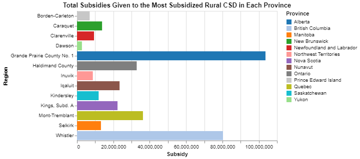

There are significant differences in the industry composition of these towns, and it is clear that there are a few distinct classes of rural CSD's which required significant assistance during the pandemic, although some regions fit more than one archetype.

- Whistler, Mont-Tremblant, Borden-Carleton, Dawson, and Clarenville all received large subsidies in accommodation and food services, retail trade, and recreation. These regions are all heavily dependent on tourism.
- Selkirk, Caraquet, Borden-Carleton, and Haldimand all received large subsidies in manufacturing. I assume all host some large manufacturing plant.
- Kings, Grande Prairie, Iqualuit, and Inuvik all received large subsidies in construction, and I assume all are fast-growing areas.
- Kindersley and Grande Prairie both received their largest subsidies in mining, oil and gas.

I expect that most heavily subsidized rural areas will fit one or more of these archetypes, being either tourist towns or industry towns. 

Authors note: We can also make graphs which show supported employees and rehired employees, but it ends up being a lot of very similar looking graphs in a row.

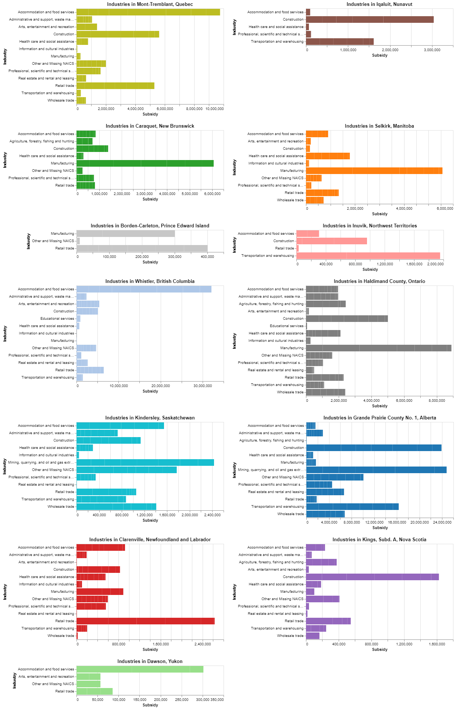

We can look at the same for the top subsidized urban region in each province. We see that the most subsidized urban CSD in each province is about what we'd expect - typically the most populous city. Note that Nunavut has no urban areas according to this classification.

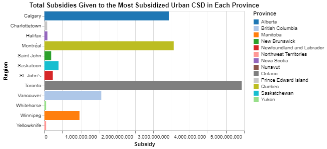

We see from looking at the industry breakdown that there are less obvious peaks than in the rural CSDs. The smaller, developing cities have received large subsidies in construction, while the larger cities (Toronto, Montreal, Vancouver) have large subsidies in "professional, technical, and scientific services". Vancouver and Charlottetown both received particularly large subsidies in the "accommodation and food service" industries.

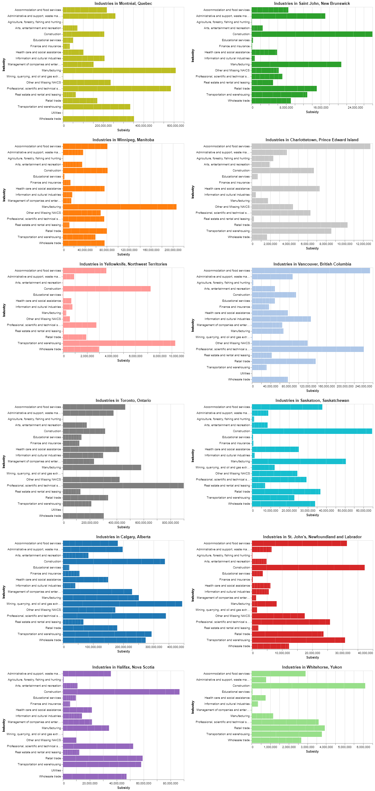

## Part 5: The accommodation and food service industry was particularly affected in rural Albera

We see that over 90% of accommodation and food service workers in rural Alberta were supported by CEWS. Food and accommodation places in tourist towns obviously lost a lot of business, and I assume places in industry towns lost a lot of business which would have come from remote workers in work camps who were unable to travel to town on their days off due to regulations. 

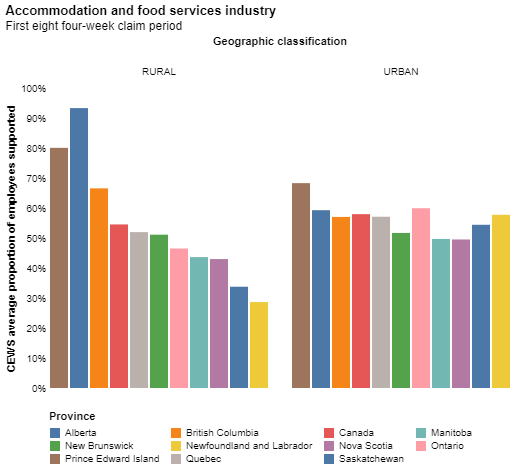

Within rural Alberta, if we break down the food and accommodation industry into its component parts, we see that more money went to accommodation, which was also more seasonal. Food service subsidies were quite consistent between claim periods (aside from the incomplete final two), while accommodation subsidies skewed heavily into the summer months.

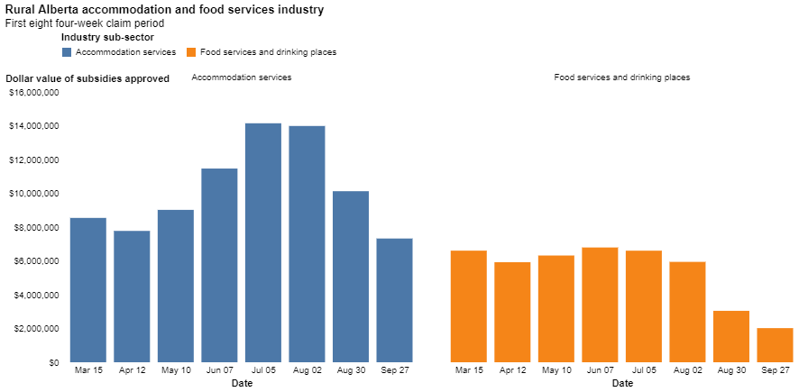

As expected, most of the most subsidized CSD's in accommodation and food service are tourist towns. By far the most supported employees were in Banff and Jasper, which are probably the most popular locations in Canada for international and interprovincial tourism. 

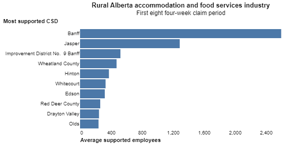

## Part 6: Count of most subsidized industries within CSDs, and breakdown of peculiar CSDs

We see that of the 1700 or so CSDs which received at least one subsidy through the CEWS program, the majority had one of a select few industries as the most subsidized.

Authors note: These two figures show the same information, but I figured I would experiment with treemaps.

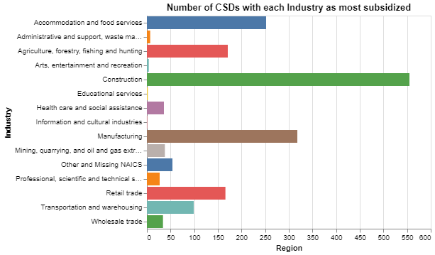

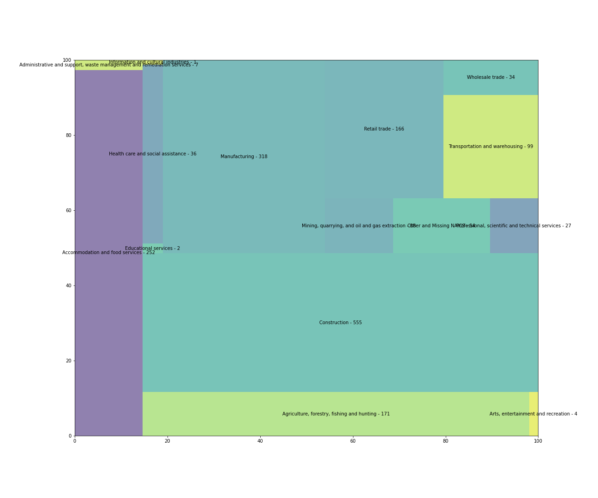

For any industry which appeared as most subsidized within a CSD at least once and less than five times, we can view the subsidy breakdown.

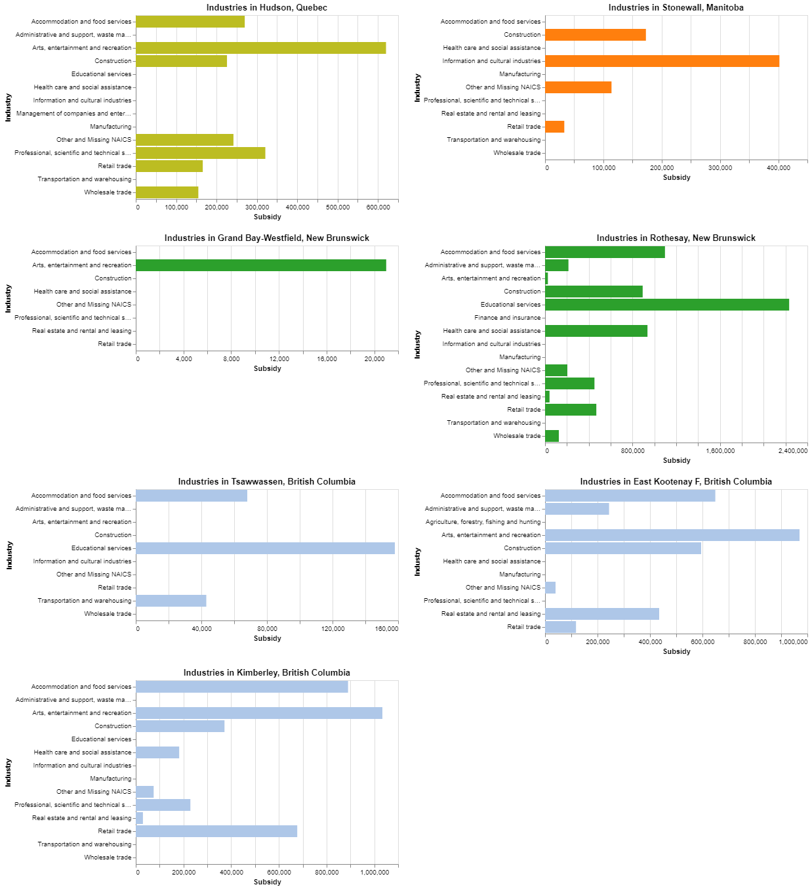